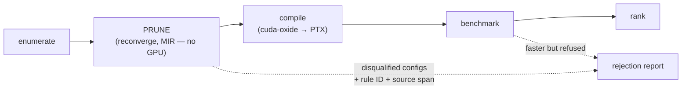

# launchbound

[](LICENSE-MIT)
[](https://crates.io/crates/launchbound-cli)
[](rust-toolchain.toml)
[](docs/ARCHITECTURE.md)
[](https://github.com/vyncint/launchbound/actions/workflows/ci.yml)

A convergence-safe autotuner for Rust GPU kernels.

`launchbound` searches the launch and specialization space of a
[`cuda-oxide`](https://github.com/NVlabs/cuda-oxide) kernel, finds the fastest
configuration, and **never hands you one that is convergence-unsafe**. On
NVIDIA it measures on real silicon. On Apple Silicon it measures on Metal.
With no GPU at all it falls back to an analytical model — and says so.

> Every design gate shipped with a measured result; the honest edges live
> in [docs/LIMITATIONS.md](docs/LIMITATIONS.md). Read that before trusting
> a result.

## Why this tool exists

```rust
if warp::warp_id() == 0 {
    thread::sync_threads();
}
```

At `block=32` this is one warp: the guard is true for every thread, nothing
diverges, the kernel is **safe**. At `block=64` it is two warps, one of them
skips a block-wide barrier, and the kernel is **undefined**. Same source,
opposite truth, decided entirely by the launch configuration.

[`simt-diff`](https://github.com/vyncint/simt-diff) measured this on a real
147-case corpus at three block sizes: **11 of 147 cases flipped from
`KNOWN_SAFE` to `KNOWN_UNSAFE` between block=32 and block=64** — 7.5% — and
the same 11 at block=128. Every one was a kernel whose divergence comes from
`warp_id()`.

The same run recorded the other half of the story: **0 cases changed the
analyzer's answer at any block size.**
[`reconverge`](https://github.com/vyncint/reconverge) is deliberately
conservative here — a launch contract is a declaration, not a proof, so these
findings stay warning-tier and never promote to a gate. `cargo reconverge
check` exits 0 on them.

An autotuner is the one tool that does not have that excuse, because it is
choosing the launch configuration itself. It can supply the contract
`reconverge` lacks and turn a warning into a decidable answer.

Therefore: **an autotuner without a convergence gate will hand you a faster
kernel that hangs**, in roughly 7.5% of `warp_id()`-guarded kernels by the
only corpus anyone has measured. No existing autotuner does this check. That
gap is this product.

## What it is, and is not

**It is not:**

- a profiler — that is Nsight Compute, and it is excellent; use it after this;
- a compiler — that is `cuda-oxide`, which this drives;
- a convergence analyzer — that is `reconverge`, which this *ships as a
  component*, does not reimplement, and does not expose as a separate feature;
- a differential laboratory for SIMT analyzers — that is `simt-diff`, whose
  launch-matrix result is this project's evidence base;
- a general-purpose autotuner — KernelTuner (Python, CUDA/OpenCL), Triton's
  autotuner (Triton only) and the CUTLASS profiler (CUTLASS only) all exist;
  none targets Rust, none is cross-backend, and none checks convergence;
- a benchmark of other people's tools.

**It is:** the autotuner for Rust GPU kernels that treats a
convergence-unsafe configuration as disqualified rather than fast.

## The pipeline



Pruning happens **before** compiling, and that ordering is the whole
efficiency story: `reconverge` runs as a wrapped `cargo build` over Stable MIR
— no PTX, no cubin, no GPU — while every `cuda-oxide` candidate configuration
is a separate full compilation. Unsafe candidates are removed at MIR cost
instead of PTX cost.

## The safety gate

For each candidate configuration at its own launch shape, `launchbound` runs
`cargo reconverge check --strict` and applies one decision rule:

- **Disqualified** — `reconverge` reports a barrier or masked-collective
  finding whose divergence source is launch-shape-dependent.
- **Admitted with a recorded caveat** — a finding exists but is
  launch-shape-independent; the caveat appears in the report.
- **Clean** — otherwise.

A `reconverge` tool error (exit 2) is a hard stop for that candidate, never a
pass by omission. The full rule, including why `--strict` is mandatory, lives
in [docs/SAFETY.md](docs/SAFETY.md) — that document is the product. A rejected
configuration is a feature, not a failure: the headline output includes every
configuration that was *faster and refused*, with the rule ID and source span.

## The three backends, stated honestly

| environment | measurement | safety gate |
|---|---|---|
| NVIDIA + CUDA toolkit (Linux) | real, on silicon, via `cuda-oxide` PTX | **full** — `reconverge` at the part's `--cc` |
| Apple Silicon | real, on Metal | **none** — see below |
| no GPU | **estimated** by the analytical model | **full** — `reconverge` needs no GPU |

Two asymmetries, published rather than buried:

- **The Metal path has no convergence gate.** `reconverge` analyses
  `cuda-oxide` kernels; there is no equivalent for MSL and this project does
  not build one. Apple GPUs have 32-wide SIMD-groups and `simd_ballot`-class
  collectives, so the same bug class exists and is simply **not checked** on
  that path. Every Metal report header says so.
- **The no-GPU path can gate but cannot measure.** It keeps the full safety
  guarantee and loses the performance truth. Its output is labelled
  `estimated` on every surface and carries the model's measured rank
  correlation. A model-derived ranking is never presented as a measurement.

## CLI

```
launchbound space  <kernel> [--json]                  # enumerate the space, print its size
launchbound prune  <kernel> --cc 8.6 [--json]         # reconverge pass only — NO GPU NEEDED
launchbound model  <kernel> --cc 8.6                  # analytical ranking — NOT GATED
launchbound tune   <kernel> --cc 8.6 --backend cuda|metal|model [--budget 30m]
launchbound report <run> [--json] [--rejected]        # includes refused-but-faster configs
launchbound apply  <run> [--no-verify]                # emit the cuda-oxide policy specialization
launchbound-tui    <run>                              # the run in four views: the chosen
                                                      # configuration and the field it beat,
                                                      # the ranking, the refusals, the progress
```

`--cc` is required by `prune`, `model` and `tune` alike — a verdict at one
compute capability does not transfer to another, and `tune` is the command
whose answer you act on. The CUDA spellings work: `--cc 86` and `--cc sm_86`
mean `8.6`.

`prune --cc` answers two questions at that capability — does the launch
shape make a barrier or a collective non-convergent, and does the static
shared memory fit — and its verdict line says so. It has **no view of
instruction availability**: whether the device code can be lowered for that
part at all is `needs_cc` in `kernel.toml`, the author's claim, taken on
trust ([docs/LIMITATIONS.md](docs/LIMITATIONS.md)).

`apply` re-verifies what it emits through the gate before printing anything.
`--no-verify` emits without it — for a machine that has the run directory
but not the analyzer, and for a Metal run, which has no convergence gate to
re-verify against — and the output carries a notice saying so.

`model` ranks the **whole** space and says so: it runs no gate and needs no
`reconverge`, so its fastest row may be a configuration that hangs. `tune
--backend model` is the gated form of the same ranking.

Exit codes: `0` a safe configuration was found; `1` the fastest candidates
were refused and the chosen one is slower than a rejected candidate — notable,
not an error; `2` tool error. `--allow-unsafe` exists, requires an explicit
reason string recorded in the report, and is never the default.

`prune` needing no GPU is the reason it exists as its own verb: it is the only
part of the pipeline a developer on a laptop can run, and it is the part that
finds the bugs. It also ships as a [GitHub Action](action/) —
`uses: vyncint/launchbound/action@v2` puts the gate in your CI.

## Compared to the neighbours

| tool | targets | measures on | convergence check | what it does better than launchbound |
|---|---|---|---|---|
| [KernelTuner](https://github.com/KernelTuner/kernel_tuner) | CUDA / OpenCL / HIP from Python | real hardware | no | mature search strategies, big ecosystem, energy tuning |
| Triton autotuner | Triton kernels | real hardware | no (Triton's model makes much of the class inexpressible) | zero-config in-framework tuning for ML workloads |
| CUTLASS profiler | CUTLASS templates | real hardware | no | exhaustive coverage of one very important kernel family |
| Nsight Compute | any CUDA binary | real hardware | no (it profiles, it does not choose) | tells you *why* a configuration is slow — use it after this tool |
| **launchbound** | Rust `cuda-oxide` kernels | CUDA / Metal / analytical model | **yes — reconverge, per candidate, at its own launch shape** | — |

## What it found, measured

On the corpus's known-flip reduction, tuned on an NVIDIA A10G (2026-08-20):
the fastest **safe** configuration was `block_x=32 tile=128` at 0.0338 ms —
and **six refused configurations measured faster, up to 3.00x**, every one
carrying RC001 with the source line (`src/lib.rs:33:13`) and the reason. An
ordinary autotuner hands you the 3.00x one; on that driver it completes
silently with undefined synchronization, which is worse than hanging.
That report is re-runnable: `launchbound report <run> --rejected`.

## Limitations

The honest list lives in [docs/LIMITATIONS.md](docs/LIMITATIONS.md) — read
it before trusting a result. Highlights: a clean gate is **not a proof of
correctness** (reconverge's documented limits are inherited wholesale, and
the launch-shape classifier recognizes the measured `warp_id()` family);
the Metal path has **no gate at all**; model output is an estimate carrying
its measured per-kernel Spearman correlation (0.00–0.94 on this corpus,
see model-calibration.toml); results are valid only for the recorded GPU,
driver, and compiler and do not port between `sm_75` and `sm_86`; and
`cuda-oxide` is alpha, so everything is pinned and the pins move together
or not at all.

## License

Dual-licensed under [MIT](LICENSE-MIT) or [Apache-2.0](LICENSE-APACHE), at
your option. Unless you explicitly state otherwise, any contribution
intentionally submitted for inclusion in the work by you, as defined in the
Apache-2.0 license, shall be dual licensed as above, without any additional
terms or conditions.
